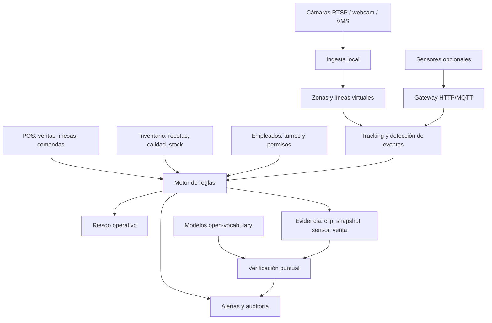

# Visión operativa para POS de restaurante/antro

Objetivo: construir una capa mayoritariamente software que use cámaras existentes, tracking, sensores ligeros y datos del POS para detectar eventos operativos relevantes: robo, descuadres, mermas no justificadas, calidad, tiempos de servicio y riesgos de inventario. El sistema no debe depender de entrenar YOLO por cada restaurante.

## Tesis técnica

El producto no debe intentar reconocer visualmente cada botella, plato o acción desde cero. Eso es frágil, caro y difícil de escalar.

La solución correcta es convertir video, sensores y POS en eventos verificables:

- movimiento en zona;
- cruce de línea;
- apertura/cierre;
- cambio de peso;
- permanencia anormal;
- salida de cocina;
- extracción de barra/almacén;
- evento sin venta asociada;
- venta sin evento físico esperado;
- diferencia entre inventario esperado e inventario real.

Los modelos visuales se usan como verificación puntual, no como única fuente de verdad.

## Diferencia contra Eagle Eye / VMS genérico

Un VMS como Eagle Eye o Milestone puede enlazar video con transacciones. El diferencial del sistema debe ser que entiende la operación del restaurante porque ya tiene:

- POS;
- comandas;
- mesas;
- recetas;
- inventario;
- calidad/vida útil;
- empleados;
- turnos;
- ventas;
- reglas de reabasto;
- motor de menú dinámico.

El sistema debe generar eventos del tipo:

> Hubo extracción en cava premium, no hubo venta premium compatible en los siguientes 90 segundos, la botella afectada tiene receta/inventario asociado, el empleado activo no tiene permiso de almacén y el inventario esperado ya mostraba diferencia.

Eso no es solo videovigilancia. Es auditoría operativa.

## Arquitectura propuesta



## Capas del sistema

### 1. Fuentes

Cada fuente debe configurarse con:

- nombre;
- tipo: cámara, sensor puerta, barrera IR/láser, báscula, sensor temperatura, VMS externo;
- zona asociada;
- latencia esperada;
- estado;
- último evento recibido;
- política de almacenamiento de evidencia.

Ejemplos:

- Cámara barra principal;
- Cámara cava premium;
- Cámara cocina caliente;
- Cámara pase de platos;
- Sensor puerta refrigerador;
- Báscula botella Don Julio 70;
- Barrera IR entrada almacén;
- Sensor temperatura refrigerador.

### 2. Zonas

El sistema debe permitir dibujar zonas sobre la imagen:

- barra;
- cava;
- refrigerador;
- caja;
- cocina;
- pase;
- almacén;
- entrada empleados;
- mesas;
- área VIP.

Cada zona tiene reglas propias:

- detectar cruce;
- detectar permanencia;
- detectar movimiento;
- requerir venta asociada;
- requerir empleado autorizado;
- requerir comanda activa;
- guardar clip;
- ignorar horarios o empleados específicos.

### 3. Eventos primarios

Estos eventos deben ser simples y repetibles:

- `zone_motion_started`;
- `zone_motion_ended`;
- `line_crossed_in`;
- `line_crossed_out`;
- `door_opened`;
- `door_closed`;
- `door_open_too_long`;
- `weight_decreased`;
- `weight_increased`;
- `temperature_out_of_range`;
- `person_in_restricted_zone`;
- `object_removed_candidate`;
- `plate_passed_candidate`;
- `camera_offline`;
- `sensor_offline`.

### 4. Eventos de negocio

El motor debe convertir eventos primarios en eventos útiles para el restaurante:

- extracción sin venta compatible;
- venta sin movimiento físico esperado;
- consumo mayor al calculado por receta;
- acceso a almacén fuera de turno;
- refrigerador abierto demasiado tiempo;
- producto en riesgo por temperatura;
- salida de platos mayor a comandas activas;
- caída de inventario físico sin orden asociada;
- posible doble preparación;
- posible producto servido sin comandar;
- posible cancelación sospechosa con movimiento físico.

## Tecnologías recomendadas

### Tracking y visión tradicional

Uso principal: detectar movimiento, zonas, líneas, permanencia y trayectorias.

Opciones:

- OpenCV;
- background subtraction;
- optical flow;
- Norfair;
- ByteTrack;
- DeepSORT;
- NVIDIA DeepStream si hay varias cámaras;
- OpenVINO si se quiere correr en CPU/Intel.

Ventaja:

- no requiere entrenar por cliente;
- funciona con cámaras existentes;
- barato;
- explicable.

Limitación:

- no identifica con certeza el objeto exacto;
- necesita buen ángulo de cámara;
- ambientes oscuros/reflejos pueden afectar.

### Sensores ligeros

Uso principal: corregir errores de cámara y dar eventos físicos confiables.

| Sensor | Uso | Prioridad |
|---|---|---|
| Sensor de puerta | Refrigeradores, almacén, cava | Alta |
| Barrera IR/láser | Cruce físico por punto específico | Alta |
| Báscula/load cell | Botellas premium, cajas, charolas | Alta |
| ToF/profundidad | Conteo de paso/personas sin imagen RGB | Media |
| Temperatura | Calidad de refrigeradores/comida | Media |
| RFID/NFC | Activos premium o almacén controlado | Baja/media |
| mmWave radar | Presencia sin cámara | Baja para MVP |

Hardware sugerido para prototipo:

- ESP32;
- sensor magnético de puerta;
- HX711 + load cell;
- barrera IR;
- sensor temperatura DS18B20 o similar;
- envío HTTP/MQTT al backend.

### Modelos visuales modernos

Uso principal: verificar eventos, no controlar todo el sistema.

Opciones:

- YOLO-World;
- YOLOE;
- Grounding DINO;
- SAM 2;
- CLIP/embeddings para búsqueda visual;
- modelos comerciales multimodales si se requiere verificación cloud.

Uso correcto:

1. El tracking/sensor detecta evento.
2. Se captura snapshot o clip corto.
3. El modelo verifica con prompt específico:
   - “beer bottle”;
   - “liquor bottle”;
   - “plate with food”;
   - “person behind bar”;
   - “cash register drawer open”.
4. El resultado se guarda como evidencia secundaria.

No debe ejecutarse como juez absoluto en tiempo real para todo.

## Modelo de datos mínimo

### `vision_sources`

- `id`;
- `name`;
- `type`;
- `url_or_identifier`;
- `zone_id`;
- `enabled`;
- `status`;
- `last_seen_at`;
- `config_json`.

### `vision_zones`

- `id`;
- `name`;
- `type`;
- `camera_source_id`;
- `polygon_json`;
- `linked_inventory_area`;
- `linked_pos_area`;
- `active_hours_json`;
- `config_json`.

### `vision_events`

- `id`;
- `source_id`;
- `zone_id`;
- `event_type`;
- `started_at`;
- `ended_at`;
- `confidence`;
- `payload_json`;
- `evidence_url`;
- `status`.

### `vision_rules`

- `id`;
- `name`;
- `enabled`;
- `scope`;
- `conditions_json`;
- `risk_score`;
- `cooldown_seconds`;
- `actions_json`.

### `vision_incidents`

- `id`;
- `rule_id`;
- `risk_level`;
- `title`;
- `description`;
- `related_order_id`;
- `related_employee_id`;
- `related_inventory_item_id`;
- `evidence_json`;
- `status`;
- `created_at`;
- `resolved_at`.

## Reglas iniciales para demo

### Regla 1: Cava premium sin venta

Condiciones:

- movimiento en zona `cava_premium`;
- o puerta de cava abierta;
- no existe venta compatible de botella premium/cocktail premium en ventana de 90 segundos;
- empleado activo no tiene permiso explícito de almacén/barra.

Resultado:

- crear incidente medio/alto;
- guardar snapshot/clip;
- relacionar productos premium afectados.

### Regla 2: Botella con peso inconsistente

Condiciones:

- báscula baja peso;
- POS reporta ventas con receta asociada;
- consumo físico estimado supera consumo por receta + tolerancia configurada.

Resultado:

- crear incidente de diferencia de inventario;
- sugerir revisión de receta, merma autorizada o posible extracción.

### Regla 3: Salida de cocina sin comanda

Condiciones:

- cruce de línea en pase de cocina;
- no existe comanda activa compatible;
- evento se repite más de N veces en turno.

Resultado:

- crear incidente;
- ligar clips a turno/cocinero/mesero si existe.

### Regla 4: Refrigerador abierto y riesgo de calidad

Condiciones:

- sensor puerta abierta > umbral;
- temperatura fuera de rango;
- productos con vida útil sensible en esa zona.

Resultado:

- crear alerta de calidad;
- afectar prioridad de menú dinámico si aplica.

### Regla 5: Movimiento en almacén fuera de horario

Condiciones:

- persona/movimiento en zona almacén;
- fuera del horario permitido;
- no hay supervisor/empleado autorizado activo.

Resultado:

- incidente alto;
- evidencia obligatoria.

## Integración con el POS existente

El motor visual no decide solo. Consulta:

- órdenes activas;
- productos vendidos;
- recetas;
- inventario esperado;
- stock real;
- calidad/vida útil;
- empleados/turnos;
- permisos;
- reglas del menú dinámico.

Ejemplo:

```text
Evento visual:
  22:14:03 movimiento en cava premium

POS:
  no hay venta premium entre 22:13:00 y 22:16:00

Inventario:
  Don Julio 70 tiene diferencia previa de -220 ml

Empleado:
  usuario activo: mesero, sin permiso de cava

Resultado:
  incidente alto con evidencia
```

## Métricas para saber si funciona

No se debe medir solo “accuracy del modelo”.

Métricas reales:

- falsos positivos por hora;
- falsos negativos detectados en auditoría manual;
- eventos sin evidencia;
- eventos con venta compatible;
- eventos que explican diferencias de inventario;
- tiempo para revisar incidente;
- reducción de diferencias no justificadas;
- cámaras/sensores activos por turno;
- latencia evento → alerta.

## Plan de implementación

### Fase A: demo software sin hardware adicional

- Crear fuentes tipo webcam/RTSP simulada.
- Dibujar zonas sobre imagen.
- Generar eventos de movimiento/cruce.
- Crear reglas iniciales contra datos POS demo.
- Mostrar incidentes con evidencia mock o snapshots.

Objetivo:

- demostrar lógica superior a un detector genérico.

### Fase B: sensores simulados y webhook

- Endpoint para recibir eventos de sensor.
- Simulador en UI: abrir puerta, bajar peso, temperatura alta.
- Reglas combinadas cámara + sensor + POS.

Objetivo:

- demostrar que el sistema no depende solo de visión.

### Fase C: primer hardware barato

- ESP32 + puerta;
- ESP32 + load cell;
- barrera IR;
- publicar eventos HTTP/MQTT.

Objetivo:

- tener una demo física confiable.

### Fase D: verificación visual avanzada

- Integrar modelo open-vocabulary solo al ocurrir incidente.
- Guardar respuesta del modelo como evidencia secundaria.

Objetivo:

- mejorar evidencia sin entrenar por restaurante.

### Fase E: integración VMS/cámaras reales

- RTSP;
- ONVIF;
- conectores a Axis/Milestone/Eagle Eye si se requiere.

Objetivo:

- vender como capa inteligente sobre infraestructura existente.

## MVP recomendado para el producto actual

Crear módulo `Operación Visual` con:

1. **Fuentes**
   - cámaras;
   - sensores;
   - estado;
   - última señal.

2. **Zonas**
   - lista de zonas;
   - configuración de reglas;
   - relación con inventario/POS.

3. **Reglas**
   - reglas editables;
   - ventanas de tiempo;
   - tolerancias;
   - severidad;
   - acciones.

4. **Auditoría**
   - incidentes;
   - evidencia;
   - relación con ventas/inventario/empleados;
   - estado de revisión.

5. **Demo**
   - botón para simular eventos;
   - escenarios preparados:
     - cava premium sin venta;
     - refrigerador abierto;
     - plato sin comanda;
     - diferencia de botella;
      - almacén fuera de horario.

## Contrato de ingesta HTTP para sensores/cámaras

El sistema debe aceptar eventos externos mediante un endpoint simple para que pueda integrarse con:

- ESP32 + sensor de puerta;
- barrera IR/láser;
- báscula/load cell;
- cámara/VMS que mande webhook;
- simulador interno de demo.

Endpoint:

```http
POST /api/vision-ops/signals
x-vision-ops-token: <token>
content-type: application/json
```

En desarrollo local se puede usar:

```txt
dev-demo-token
```

En producción debe configurarse:

```txt
VISION_OPS_INGEST_TOKEN=<token largo aleatorio>
```

### Payload base

```json
{
  "signal": {
    "zone": "Almacen",
    "event": "Cruce fisico hacia barra",
    "source": "sensor",
    "confidence": 0.94
  },
  "pos": {
    "hasCompatibleSale": false,
    "hasActiveTransfer": false,
    "hasReadyOrder": false,
    "hasAuthorizedEmployee": false,
    "hasActivePreparation": false
  },
  "inventory": {
    "itemName": "Caja de cerveza",
    "currentDifference": -1,
    "tolerance": 0
  }
}
```

Respuesta esperada:

```json
{
  "ok": true,
  "incident": {
    "zone": "Almacen",
    "event": "Cruce fisico hacia barra",
    "posContext": "Sin transferencia activa",
    "inventoryContext": "Producto no registrado: Caja de cerveza",
    "result": "Salida no justificada",
    "risk": "critical",
    "evidenceLabel": "clip-almacen-23-31"
  }
}
```

### Ejemplo: barrera IR/láser en almacén

```json
{
  "signal": {
    "zone": "Almacen",
    "event": "Cruce fisico hacia barra",
    "source": "sensor",
    "confidence": 1
  },
  "pos": {
    "hasActiveTransfer": false,
    "hasAuthorizedEmployee": false
  },
  "inventory": {
    "itemName": "Caja de cerveza"
  }
}
```

### Ejemplo: báscula en botella premium

```json
{
  "signal": {
    "zone": "Cava",
    "event": "Bascula reporta -240 ml",
    "source": "scale",
    "quantityChange": -240
  },
  "pos": {
    "hasCompatibleSale": true,
    "recipeExpectedQuantity": 135
  },
  "inventory": {
    "itemName": "Don Julio 70",
    "tolerance": 45
  }
}
```

### Ejemplo: refrigerador abierto demasiado tiempo

```json
{
  "signal": {
    "zone": "Refrigerador",
    "event": "Puerta abierta 4m 20s",
    "source": "sensor",
    "durationSeconds": 260
  },
  "pos": {
    "hasActivePreparation": false
  },
  "inventory": {
    "itemName": "Productos perecederos",
    "qualitySensitive": true
  }
}
```

La regla de producto es que el sensor no decide solo. El sensor manda una señal física; el motor cruza esa señal contra contexto de POS, inventario, recetas, calidad y empleados.

## Decisión final

La arquitectura ganadora es:

> Cámaras existentes + tracking por zonas + sensores baratos opcionales + POS/inventario/recetas como contexto + modelos modernos solo para verificar incidentes.

Eso mantiene la mayoría del valor en software, evita entrenar YOLO por restaurante y crea una ventaja real frente a un VMS genérico.
